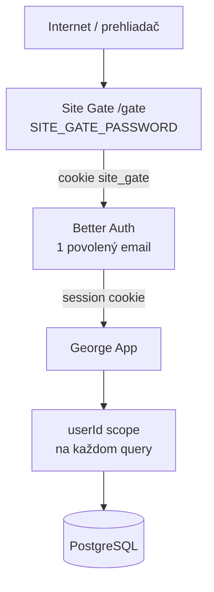
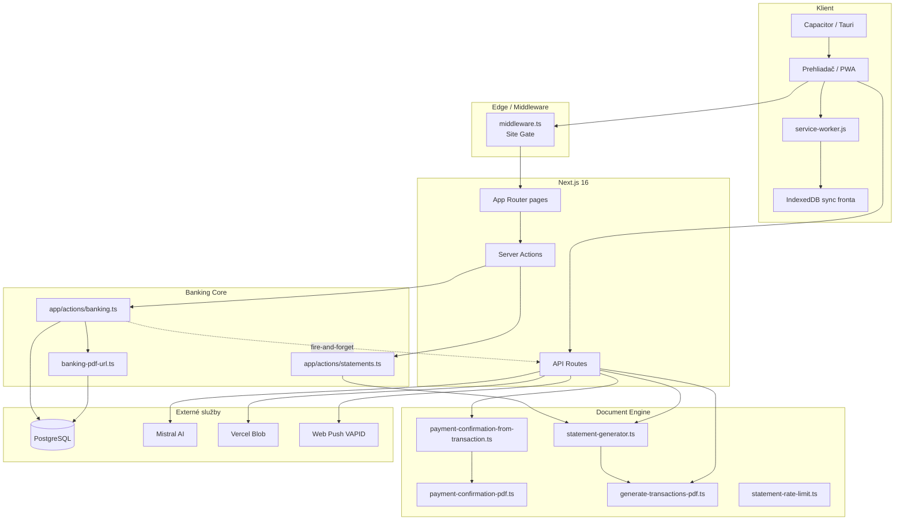
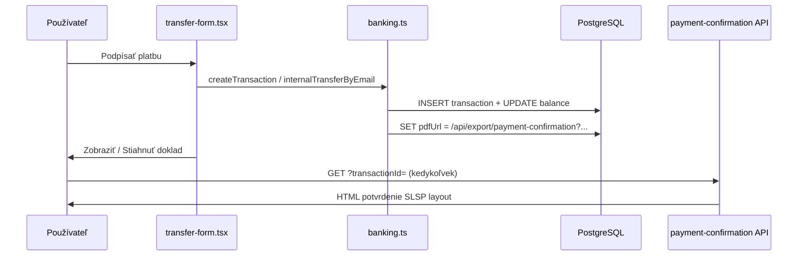
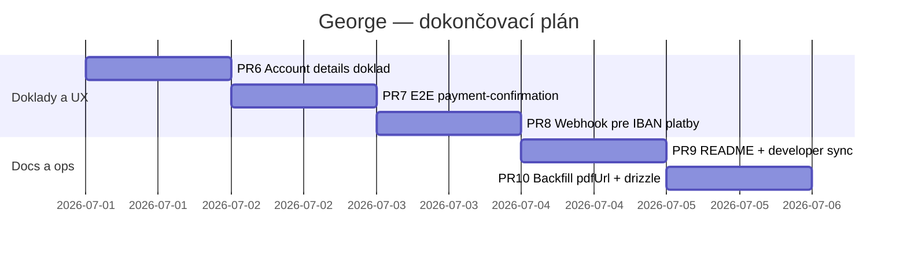

# George Internetbanking PWA — Finálny Mega Blueprint

> **Verzia:** 2.0 · **Dátum:** 30. 6. 2026  
> **Vetva:** `feat/html-statements`  
> **Repo:** https://github.com/NEXIFY-STUDIO/georg (private)  
> **Produkcia:** https://george-dev.vercel.app  
> **Vercel projekt:** `george-dev`  

Tento dokument je **jediný zdroj pravdy** pre celý projekt George — architektúru, všetky funkcie, bezpečnosť, dokumenty (HTML/PDF), generátor výpisov, PWA, asistenta, deploy, testy, známe medzery a roadmapu na 100 %.

---

## Obsah

1. [Vízia a rozsah produktu](#1-vízia-a-rozsah-produktu)
2. [Bezpečnostné vrstvy](#2-bezpečnostné-vrstvy)
3. [Technologický stack](#3-technologický-stack)
4. [Architektúra — celkový diagram](#4-architektúra--celkový-diagram)
5. [Mapa rout, obrazoviek a navigácie](#5-mapa-rout-obrazoviek-a-navigácie)
6. [Kompletný API katalóg](#6-kompletný-api-katalóg)
7. [Server Actions — banková logika](#7-server-actions--banková-logika)
8. [Databázová schéma (všetky tabuľky)](#8-databázová-schéma-všetky-tabuľky)
9. [Dokumentový systém (jádro projektu)](#9-dokumentový-systém-jádro-projektu)
10. [Generátor 3 mesačných výpisov](#10-generátor-3-mesačných-výpisov)
11. [George AI asistent](#11-george-ai-asistent)
12. [PWA, offline sync a push notifikácie](#12-pwa-offline-sync-a-push-notifikácie)
13. [i18n a UI komponenty](#13-i18n-a-ui-komponenty)
14. [Súborová mapa (kompletná)](#14-súborová-mapa-kompletná)
15. [Stav implementácie — master checklist](#15-stav-implementácie--master-checklist)
16. [Roadmap PR1–PR10](#16-roadmap-pr1pr10)
17. [Testovacia stratégia](#17-testovacia-strategia)
18. [Environment variables](#18-environment-variables)
19. [Deploy — Vercel, VPS, Ubuntu](#19-deploy--vercel-vps-ubuntu)
20. [Známe limitácie a rozhodnutia](#20-známe-limitácie-a-rozhodnutia)
21. [Troubleshooting](#21-troubleshooting)
22. [Definícia „100 % hotové“](#22-definícia-100--hotové)
23. [Odkazy a referencie](#23-odkazy-a-referencie)

---

## 1. Vízia a rozsah produktu

**George** je demo internet banking PWA v štýle Slovenskej sporiteľne (SLSP/George). Nie je to produkčná banka — je to realistický sandbox s bankovým UX a oficiálnymi SLSP HTML šablónami.

### Hlavné ciele

| # | Cieľ | Stav |
|---|------|------|
| 1 | Prihlásenie jedného povoleného používateľa | ✅ |
| 2 | Site gate pred verejnou URL | ✅ |
| 3 | Dashboard s SPACE účtom, kartami, históriou | ✅ |
| 4 | Platba IBAN alebo e-mail (interný prevod) | ✅ |
| 5 | **Doklad z každej novej platby** (HTML, tlačiteľné ako PDF) | ✅ |
| 6 | **Hromadný generátor 3 mesačných výpisov** | ✅ |
| 7 | Mesačný výpis z reálnych DB transakcií | ✅ |
| 8 | George AI asistent (Mistral) | ✅ |
| 9 | PWA + service worker + offline fallback | ✅ |
| 10 | Web Push notifikácie (VAPID) | ✅ (infra) |
| 11 | Offline sync fronta (IndexedDB) | ✅ (infra) |
| 12 | Capacitor / Tauri wrappery | ✅ (pripravené skripty) |
| 13 | i18n SK/EN | ✅ (čiastočne — generátor len SK) |

### Čo produkt **nie je**

- Pravá banka ani právny doklad o platbe
- Multi-tenant produkčný systém
- Automatické PDF súbory na disku (primárne HTML on-demand)
- Verejný open-source repozitár

---

## 2. Bezpečnostné vrstvy



| Vrstva | Účel | Implementácia | Default |
|--------|------|---------------|---------|
| **Site Gate** | Skryje app pred náhodnými návštevníkmi | `middleware.ts`, `/gate`, `/api/gate` | heslo `heslo` |
| **Better Auth** | Skutočné prihlásenie | `lib/auth.ts`, hook na 1 email | `anton-karton-007@proton.me` |
| **Session** | Chránené stránky a API | 7 dní, cookie | Better Auth |
| **Ownership** | Izolácia dát | `getUserId()` v každej action | vždy |
| **API auth** | Export dokladov | Session check v route handler | 401 bez session |

### Prihlasovacie údaje (demo)

| Prostredie | Email | Heslo | Site gate |
|------------|-------|-------|-----------|
| Produkcia | `anton-karton-007@proton.me` | `admin@admin.com` | `heslo` |
| Lokál dev | z `.env.local` / secrets | z `.env.local` | `heslo` alebo vypnuté |

**Poznámka:** V sign-in formulári je email pole, heslo pole — **heslo ide do poľa Password**, nie do emailu.

### Auth konfigurácia (`lib/auth.ts`)

- Povolený email: z `/Users/erikbabcan/Documents/secrets/testuser01.json` alebo default
- `trustedOrigins`: localhost `3030`, `3355`, `10.0.2.2:3030`, Vercel URL
- Dev: `sameSite: 'none'`, `secure: true` pre iframe preview

---

## 3. Technologický stack

| Vrstva | Technológia | Verzia / poznámka |
|--------|-------------|-------------------|
| Framework | Next.js App Router | 16.2.6 |
| UI | React | 19 |
| Štýly | Tailwind CSS | 4.x |
| Komponenty | shadcn/ui, Radix, Base UI | — |
| Auth | Better Auth | 1.x + PostgreSQL adapter |
| ORM | Drizzle ORM | 0.45.x |
| DB | PostgreSQL | VPS kontajner / lokál |
| Dokumenty | HTML string šablóny (SLSP) | primárny formát |
| ZIP | fflate | client-side |
| Legacy PDF | pdfmake, pdf-lib | webhook / staré testy |
| AI | Mistral API | asistent + webhook text |
| Push | web-push + VAPID | — |
| Offline | idb (IndexedDB) + service worker | — |
| State | Zustand | `lib/stores/useAppStore.ts` |
| Mobile | Capacitor 6 | `cap:sync`, Android |
| Desktop | Tauri 2 | `npm run tauri` |
| Deploy | Vercel | projekt `george-dev` |
| Testy | Playwright + tsx unit | 13 E2E + 1 unit |
| Analytics | Vercel Analytics | `@vercel/analytics` |

**Dev port:** `3030` (`npm run dev`)  
**Lokálna DB:** `postgresql://localhost:5432/internet_bank`

---

## 4. Architektúra — celkový diagram



---

## 5. Mapa rout, obrazoviek a navigácie

### Verejné / auth routy

| Route | Typ | Popis |
|-------|-----|-------|
| `/` | redirect | → dashboard alebo sign-in |
| `/gate` | gate | Site gate formulár |
| `/sign-in` | auth | Prihlásenie George |
| `/sign-up` | auth | Registrácia (obmedzená na 1 email) |

### Chránené routy

| Route | Popis | Kľúčové komponenty |
|-------|-------|-------------------|
| `/dashboard` | Hlavný dashboard | `dashboard-client.tsx`, `add-money-footer.tsx` |
| `/dashboard/accounts/[id]` | Detail účtu | `account-details-client.tsx` |
| `/dashboard/payment-orders` | Platobné príkazy | `payment-orders-client.tsx` |
| `/dashboard/assistant` | AI asistent dashboard | `assistant-dashboard-client.tsx` |
| `/dashboard/statements/generator` | **Generátor 3 výpisov** | `statement-generator-client.tsx` |
| `/dashboardpayment` | Prehľad platieb za mesiac | `dashboardpayment-client.tsx` |
| `/test-pdf` | Dev test potvrdenia | — |

### Menu (dashboard-header)

| Položka menu | Akcia |
|--------------|-------|
| Nová platba | `CustomEvent('open-transfer-modal')` → `transfer-form.tsx` |
| Platobné príkazy | `/dashboard/payment-orders` |
| Asistent | `/dashboard/assistant` |
| Výpisy | `/dashboard/statements/generator` |
| Platby – Apríl | `/dashboardpayment` |
| Notifikácie | VAPID subscribe → `/api/webhooks/push/subscribe` |
| Odhlásenie | Better Auth sign-out |

### Dashboard UX prvky

- **SPACE účet** — auto-vytvorenie pri prvom prihlásení (`app/dashboard/page.tsx`)
- **Demo karty** — statické UI
- **Prehľad prevodov** — filtre: Všetko / Prijaté / Odoslané / Dobitie
- **+ Peniaze** — sticky footer, `depositFunds()`
- **Asistent widget** — plávajúce okno vpravo dole

---

## 6. Kompletný API katalóg

### 6.1 Autentifikácia

```
GET/POST /api/auth/[...all]
```

Better Auth: sign-in, sign-up, sign-out, get-session, atď.

### 6.2 Prístup

```
POST /api/gate
```

Body: `{ password: string }` → nastaví cookie `site_gate`.

### 6.3 Bankové dokumenty

| Endpoint | Metóda | Auth | Popis |
|----------|--------|------|-------|
| `/api/export/payment-confirmation?transactionId=` | GET | Session | **Potvrdenie o 1 platbe** (HTML inline) |
| `/api/export/pdf?accountId=&month=YYYY-MM` | GET | Session | Mesačný výpis z DB (`month` voliteľný; bez neho posledných 500 txn) |
| `/api/statements/generate-bulk` | POST | Session | **3 simulované mesačné výpisy** |

#### Payment confirmation API — detail

```
GET /api/export/payment-confirmation?transactionId=<uuid>
```

- Overí session + `transaction.userId`
- Povolené typy: `withdrawal`, `transfer`
- Načíta `bank_account` pre `fromAccountId`
- `buildPaymentConfirmationFromTransaction()` → `generatePaymentConfirmationHtml()`
- Response: `text/html; charset=utf-8`, `Content-Disposition: inline`

#### Bulk statements API — detail

```
POST /api/statements/generate-bulk
```

```json
{
  "accountId": "uuid",
  "displayName": "Môj SPACE účet",
  "transactionsPerMonth": 20,
  "averageMonthlyTurnoverEur": 3000,
  "mix": { "outgoing": 70, "incoming": 20, "topup": 10 },
  "persistToDatabase": false
}
```

Response:
```json
{
  "statements": [
    { "month": "2026-04", "html": "...", "filename": "Vypis_202604_..." }
  ]
}
```

Rate limit: 5/hod/user (`lib/statement-rate-limit.ts`, in-memory).

### 6.4 Webhooky a sync

| Endpoint | Metóda | Popis |
|----------|--------|-------|
| `/api/webhooks/process-payment` | POST | Mistral text, pdf-lib PDF, Blob/FS, push, update `pdfUrl` |
| `/api/webhooks/push/subscribe` | POST | Uloží push subscription do DB |
| `/api/sync` | POST | Sync offline fronty z IndexedDB |

**Webhook `process-payment` — kedy sa volá:**
- ✅ `internalTransferByEmail()` — fire-and-forget cez `triggerProcessPaymentWebhook()`
- ✅ `createTransaction()` (IBAN platby) — rovnaký helper (PR8)

### 6.5 Asistent a diagnostika

| Endpoint | Metóda | Popis |
|----------|--------|-------|
| `/api/assistant/chat` | POST | George AI chat (Mistral) |
| `/api/test-db` | GET | Diagnostika DB pripojenia |

---

## 7. Server Actions — banková logika

Všetky actions v `app/actions/` overujú session cez `getUserId()`.

### `app/actions/banking.ts`

| Funkcia | Popis | Side effects |
|---------|-------|--------------|
| `getBankAccounts()` | Účty používateľa | — |
| `createBankAccount(type, currency)` | Nový účet SK67 IBAN | revalidate dashboard |
| `getAccountBalance(accountId)` | Zostatok v centoch | — |
| `getTransactions(limit)` | Posledné transakcie usera | — |
| `getAccountTransactions(accountId, limit)` | Transakcie účtu (in+out) | — |
| `createTransaction(from, to, amount, type, desc)` | Externá platba / withdrawal | balance↓, `pdfUrl`, revalidate |
| `depositFunds(accountId, amount, desc)` | Dobitie (+ Peniaze) | balance↑, deposit txn |
| `internalTransferByEmail(from, email, amount, desc)` | Prev od user→user | 2 txn, webhook, `pdfUrl` |

### `app/actions/statements.ts`

| Funkcia | Popis |
|---------|-------|
| `generateBulkStatementsAction(config)` | Wrapper pre generátor + voliteľný persist do DB |

### Kritické helpery

| Súbor | Funkcia | Účel |
|-------|---------|------|
| `lib/banking-pdf-url.ts` | `attachPaymentConfirmationUrl(txnId)` | Nastaví `pdfUrl` na API path |
| `lib/payment-confirmation-from-transaction.ts` | `encodeTransactionDescription()` | 8-polí do `description` |
| `lib/payment-confirmation-from-transaction.ts` | `buildPaymentConfirmationFromTransaction()` | DB → HTML data |

---

## 8. Databázová schéma (všetky tabuľky)

### Better Auth (nemeníť camelCase stĺpce!)

| Tabuľka | Účel |
|---------|------|
| `user` | Používatelia |
| `session` | Relácie (7 dní) |
| `account` | Auth credentials (password hash) |
| `verification` | Email verification tokeny |

### Banking

**`bank_account`**
```
id, userId, accountNumber (unique), displayName?, accountType,
balance (INTEGER centy!), currency, isActive, createdAt, updatedAt
```

**`transaction`**
```
id, userId, fromAccountId?, toAccountId?, amount (centy),
balanceBefore?, balanceAfter?, type (deposit|withdrawal|transfer),
description?, pdfUrl?, status, createdAt, updatedAt
```

Indexy: `userId`, `createdAt`.

### Asistent

| Tabuľka | Účel |
|---------|------|
| `assistant_conversation` | Konverzácie |
| `assistant_message` | Správy (user/assistant/system/tool) |
| `assistant_run_log` | Logy volaní Mistral |

### Push

| Tabuľka | Účel |
|---------|------|
| `push_subscription` | Web Push endpoint + kľúče |

### Formát `transaction.description` (8 polí)

```
meno|poznámka|kategória|iban|vs|ks|ss|referencia
```

Príklad:
```
Tesco Stores SR|Nákup potravín|Nezaradené výdavky|SK68 0900 ...|123|0308||
```

**Staré transakcie** môžu mať 3 polia — doklad sa vygeneruje, ale IBAN/VS môžu chýbať.

### `pdfUrl` — dva režimy

| Režim | Hodnota | Kedy |
|-------|---------|------|
| On-demand HTML | `/api/export/payment-confirmation?transactionId=...` | Nové platby (default) |
| Blob/static | `https://...blob.../pdfs/xxx.pdf` | Po webhook `process-payment` |

### Migrácie (Drizzle)

| Súbor | Zmena |
|-------|-------|
| `drizzle/0000_smart_gamma_corps.sql` | Počiatočná schéma |
| `drizzle/0001_account_display_name.sql` | `bank_account.displayName` |
| `drizzle/meta/0000_snapshot.json` | Snapshot (0001 snapshot chýba — gap PR10) |

```bash
npm run db:migrate
# alebo manuálne na prod:
psql $DATABASE_URL -c 'ALTER TABLE bank_account ADD COLUMN IF NOT EXISTS "displayName" text;'
```

---

## 9. Dokumentový systém (jádro projektu)

### 9.1 Dva typy dokumentov — NIKDY nemiešať

| Typ | Engine | Vstup | Výstup |
|-----|--------|-------|--------|
| **Potvrdenie o platbe** | `lib/payment-confirmation-pdf.ts` | 1 transakcia | HTML (1 strana) |
| **Mesačný výpis** | `lib/generate-transactions-pdf.ts` | N transakcií + zostatky | HTML (viac strán) |

### 9.2 HTML vs PDF — aktuálna pravda

| Dokument | Primárny formát | Ako získať PDF |
|----------|-----------------|----------------|
| Potvrdenie platby | **HTML** cez API / klient | Ctrl+P / Print to PDF |
| Mesačný výpis | **HTML** | Ctrl+P / Print to PDF |
| Webhook output | pdf-lib (server) | Blob URL (voliteľné) |

> **README.md a developer.md** sú synchronizované s HTML-first prístupom (aktualizované v PR9).

### 9.3 Klientske helpery (`lib/payment-confirmation-pdf.ts`)

| Funkcia | Kde beží |
|---------|----------|
| `generatePaymentConfirmationHtml(data)` | Server + klient |
| `getPaymentConfirmationFilename(data)` | Server + klient |
| `openPaymentConfirmationHtml(url)` | Klient |
| `downloadPaymentConfirmationPdf(url)` | Klient (stiahne HTML) |

### 9.4 Flow — platba → doklad



### 9.5 Flow — mesačný výpis z DB

```
account-details-client.tsx → GET /api/export/pdf?accountId=...&month=YYYY-MM
→ generateTransactionsPdf() → HTML inline
```

### 9.6 SLSP šablónové assety

| Súbor | Účel |
|-------|------|
| `public/assets/logo-slovenska-sporitelna.png` | Logo v HTML |
| `lib/logo-base64.ts` | Inline logo pre PDF legacy |
| `docs/VVVypis.html` | Referenčná predloha výpisu |
| `docs/pdf-vysledok.html` | Referenčný výstup |
| `components/pdf-statement-template.tsx` | React verzia (legacy canvas flow) |

---

## 10. Generátor 3 mesačných výpisov

### UI: `/dashboard/statements/generator`

Komponent: `components/statement-generator-client.tsx`

### Parametre

| Pole | Rozsah | Default |
|------|--------|---------|
| `displayName` | 2–60 znakov | SPACE účet |
| `transactionsPerMonth` | 10–30 | 20 |
| `averageMonthlyTurnoverEur` | 100 – 500 000 | 3 000 € |
| Mix outgoing/incoming/topup | % | 70 / 20 / 10 |
| `persistToDatabase` | checkbox | **OFF** |

**Obrat** = súčet `|amount|` všetkých transakcií v mesiaci (v centoch).

### Algoritmus (`lib/statement-generator.ts`)

1. 3 po sebe idúce kalendárne mesiace (aktuálny −2, −1, 0)
2. Seeded RNG pre reprodukovateľnosť
3. Mix typov: withdrawal (outgoing), deposit (incoming), topup
4. Slovenskí protistrany (Tesco, Alza, Daňový úrad, …)
5. Náhodné SK IBAN (`0900`, `0200`, …)
6. `encodeTransactionDescription()` pre každú simulovanú platbu
7. Bežiaci zostatok: `balanceBefore` / `balanceAfter` na každej txn
8. Výstup: `GeneratedMonthStatement[]` → `generateTransactionsPdf()`

### ZIP download

Client-side cez `fflate` — 3 HTML súbory v jednom ZIP.

### Persist režim

Ak `persistToDatabase: true`:
- INSERT transakcií do `transaction`
- UPDATE `bank_account.balance` na finálny zostatok
- UPDATE `displayName` ak zadaný

---

## 11. George AI asistent

### Komponenty

| Súbor | Účel |
|-------|------|
| `components/assistant/assistant-widget.tsx` | Plávajúci chat na dashboarde |
| `components/assistant/assistant-dashboard-client.tsx` | `/dashboard/assistant` |
| `lib/assistant/mistral.ts` | Mistral API wrapper |
| `lib/assistant/context.ts` | Kontext: účty, zostatky, transakcie |
| `lib/assistant/web-search.ts` | Voliteľný web search |
| `app/api/assistant/chat/route.ts` | POST endpoint |

### Bezpečnostné pravidlá asistenta

- ✅ Číta dáta prihláseného používateľa
- ✅ Vysvetľuje postup v demo bankingu
- ❌ **Nesmie** vykonať platbu ani meniť zostatky

### Demo režim

Bez `MISTRAL_API_KEY` → odpovede označené ako demo, správy sa ukladajú do DB.

### Dashboard metriky (`/dashboard/assistant`)

- Stav `MISTRAL_API_KEY`
- Aktívny model (`MISTRAL_MODEL`, default `mistral-small-latest`)
- Web search enabled
- Počet konverzácií / správ
- Posledná chyba z `assistant_run_log`

---

## 12. PWA, offline sync a push notifikácie

### PWA manifest

| Súbor | Účel |
|-------|------|
| `public/manifest.json` | Názov George, ikony, theme |
| `public/service-worker.js` | Cache + offline |
| `public/offline.html` | Fallback bez siete |
| `public/icon-*.png` | 192, 512, maskable |

Registrácia SW v `app/layout.tsx`.

### Offline sync

```
lib/sync/db.ts          → IndexedDB operácie
lib/sync/middleware.ts  → Zustand middleware + dispatchOfflineAction
app/api/sync/route.ts   → Server sync endpoint
```

Flow: optimistic UI update → ak offline, fronta v IDB → po reconnect `POST /api/sync`.

### Web Push

1. Menu → Notifikácie → `Notification.requestPermission()`
2. `pushManager.subscribe()` s `NEXT_PUBLIC_VAPID_PUBLIC_KEY`
3. `POST /api/webhooks/push/subscribe` → `push_subscription` tabuľka
4. Webhook `process-payment` odošle push príjemcovi

### Capacitor / Tauri

| Skript | Účel |
|--------|------|
| `npm run cap:sync` | Sync web build do Android |
| `npm run cap:open` | Otvor Android Studio |
| `npm run tauri` | Desktop wrapper |

Capacitor fetch redirect v `layout.tsx`: relatívne URL → `http://10.0.2.2:3030`.

---

## 13. i18n a UI komponenty

### Internacionalizácia

| Súbor | Účel |
|-------|------|
| `lib/i18n.ts` | `getDictionary(locale)` |
| `lib/dictionaries/sk.ts` | Slovenčina |
| `lib/dictionaries/en.ts` | Angličtina |
| `components/language-switcher.tsx` | Prepínač SK/EN |
| Cookie `NEXT_LOCALE` | Perzistencia jazyka |

**Gap:** Generátor výpisov má texty len po slovensky.

### Kľúčové UI komponenty

| Komponent | Účel |
|-----------|------|
| `auth-form.tsx` | Sign-in/up (bez prefilled hesla — hydration fix) |
| `site-gate-form.tsx` | Site gate |
| `transfer-form.tsx` | Nová platba + doklad tlačidlá |
| `dashboard-client.tsx` | História + modal dokladu |
| `account-details-client.tsx` | Detail účtu + mesačný výpis |
| `transactions-list.tsx` | Zoznam transakcií |
| `add-money-footer.tsx` | + Peniaze panel |
| `account-card.tsx` | Karta účtu |
| `payment-orders-client.tsx` | Platobné príkazy (demo) |

### Formátovanie dátumov

`lib/format-date.ts` — vždy `Europe/Bratislava`, hydration-safe (fix React #418).

---

## 14. Súborová mapa (kompletná)

```
george-dev/
├── app/
│   ├── actions/
│   │   ├── banking.ts              # Všetka banková logika
│   │   └── statements.ts           # Generátor wrapper
│   ├── api/
│   │   ├── auth/[...all]/          # Better Auth
│   │   ├── assistant/chat/         # Mistral chat
│   │   ├── export/
│   │   │   ├── payment-confirmation/  # GET HTML doklad
│   │   │   └── pdf/                   # GET mesačný výpis
│   │   ├── gate/                   # Site gate POST
│   │   ├── statements/generate-bulk/  # POST 3 výpisy
│   │   ├── sync/                   # Offline sync
│   │   ├── test-db/                # Diagnostika
│   │   └── webhooks/
│   │       ├── process-payment/    # Async PDF + push
│   │       └── push/subscribe/     # Push registration
│   ├── dashboard/
│   │   ├── page.tsx                # Auto-create SPACE account
│   │   ├── accounts/[id]/        # Detail účtu
│   │   ├── assistant/              # AI dashboard
│   │   ├── payment-orders/       # Platobné príkazy
│   │   └── statements/generator/ # Generátor výpisov
│   ├── gate/                       # Site gate page
│   ├── sign-in/ sign-up/
│   └── test-pdf/                   # Dev test
├── components/
│   ├── assistant/                  # Widget + dashboard
│   ├── providers/                  # TranslationProvider
│   ├── ui/                         # shadcn
│   ├── transfer-form.tsx
│   ├── dashboard-client.tsx
│   ├── dashboard-header.tsx
│   ├── statement-generator-client.tsx
│   ├── account-details-client.tsx
│   └── ...
├── lib/
│   ├── auth.ts auth-client.ts
│   ├── db/ schema.ts index.ts
│   ├── payment-confirmation-pdf.ts
│   ├── payment-confirmation-from-transaction.ts
│   ├── generate-transactions-pdf.ts
│   ├── statement-generator.ts
│   ├── statement-rate-limit.ts
│   ├── banking-pdf-url.ts
│   ├── format-date.ts
│   ├── site-gate.ts
│   ├── assistant/                  # Mistral, context, web-search
│   ├── sync/                       # IDB + middleware
│   ├── dictionaries/               # sk, en
│   └── stores/useAppStore.ts
├── drizzle/
│   ├── 0000_smart_gamma_corps.sql
│   ├── 0001_account_display_name.sql
│   └── meta/
├── e2e/                            # 13 Playwright testov
├── scripts/
│   ├── statement-generator.test.ts # Unit testy
│   └── seed-users.ts
├── public/
│   ├── manifest.json service-worker.js
│   └── assets/                     # SLSP logo
├── docs/
│   └── FINAL-BLUEPRINT.md          # ← tento dokument
├── middleware.ts
├── README.md                       # synchronizované (PR9)
└── developer.md                    # synchronizované (PR9)
```

---

## 15. Stav implementácie — master checklist

### F0 — Infra a bezpečnosť
- [x] Site gate (`middleware.ts`, `/gate`)
- [x] Better Auth + 1 email lock
- [x] Hydration fix (#418): dátumy, prázdne heslo v sign-in
- [x] `trustedOrigins` pre port 3355
- [x] Vercel deploy `george-dev`
- [x] GitHub push `NEXIFY-STUDIO/georg`
- [x] DB migrácia `displayName` (lokál + prod)

### F1 — Doklady z platieb
- [x] `GET /api/export/payment-confirmation?transactionId=`
- [x] `attachPaymentConfirmationUrl()` po platbe
- [x] `encodeTransactionDescription()` — 8 polí
- [x] Tlačidlá po platbe (Zobraziť + Stiahnuť) v `transfer-form.tsx`
- [x] Tlačidlá v dashboarde (modal transakcie) v `dashboard-client.tsx`
- [x] Jeden HTML engine `generatePaymentConfirmationHtml()`
- [x] Doklad v `account-details-client.tsx` (per-payment) — PR6
- [ ] Inline tlačidlo v riadku histórie na dashboarde — nice-to-have
- [x] Backfill `pdfUrl` pre staré withdrawals — `npm run db:backfill-pdf-url`

### F2 — Generátor výpisov
- [x] `/dashboard/statements/generator`
- [x] `POST /api/statements/generate-bulk`
- [x] `lib/statement-generator.ts`
- [x] Unit testy `scripts/statement-generator.test.ts`
- [x] E2E `e2e/statement-generator.spec.ts`
- [x] 3 mesiace, ZIP (fflate), preview/persist
- [x] `displayName` v šablóne (fix hardcoded SPACE)
- [x] Rate limit 5/hod

### F3 — Bankový core
- [x] SPACE auto-create
- [x] IBAN platby (`createTransaction`)
- [x] E-mail prevody (`internalTransferByEmail`)
- [x] Dobitie (`depositFunds` / + Peniaze)
- [x] Filtre histórie (Všetko/Prijaté/Odoslané/Dobitie)
- [x] Mesačný výpis z DB (`/api/export/pdf`)

### F4 — Asistent
- [x] Widget + dashboard
- [x] Mistral integrácia
- [x] Demo režim bez API key
- [x] DB perzistencia konverzácií
- [x] Web search (voliteľné)

### F5 — PWA / Push / Sync
- [x] manifest + service worker + offline.html
- [x] Push subscribe flow
- [x] Offline sync infra (IDB + API)
- [x] Capacitor + Tauri skripty

### F6 — Testy a docs
- [x] Unit test generátora
- [x] E2E generátor
- [x] E2E production smoke (`production-check.spec.ts`)
- [x] E2E payment-confirmation API — PR7
- [x] README + developer sync — PR9
- [x] Drizzle meta snapshot 0001 — PR10

### Zámerné zjednodušenia
- HTML primárne, nie binárne PDF súbory
- `pdfUrl` = API path (nie Blob) pre nové platby
- Rate limit in-memory (reset pri redeploy)
- Webhook je voliteľný doplnok (UI doklad funguje bez neho)
- Staré txn = neúplný doklad

---

## 16. Roadmap PR1–PR10

### Už implementované (PR1–PR5)

| PR | Názov | Stav |
|----|-------|------|
| PR1 | Payment confirmation API + HTML engine | ✅ |
| PR2 | `pdfUrl` + `encodeTransactionDescription` | ✅ |
| PR3 | UI dokladu (transfer-form + dashboard modal) | ✅ |
| PR4 | Statement generator core + API | ✅ |
| PR5 | Generator UI + E2E + migrácia displayName | ✅ |

### Zostávajúce (PR6–PR10)



| PR | Názov | Súbory | Akceptačné kritérium |
|----|-------|--------|---------------------|
| **PR6** | Doklad v detaile účtu | `account-details-client.tsx` | Pri outgoing txn: Zobraziť/Stiahnuť |
| **PR7** | E2E payment API | `e2e/payment-pdf-content.spec.ts` | Platba → GET API → HTML obsahuje IBAN, VS, sumu |
| **PR8** | Webhook pre IBAN | `banking.ts` `createTransaction` | Rovnaký fire-and-forget ako e-mail platba |
| **PR9** | Dokumentácia | `README.md`, `developer.md` | george-dev URL, HTML-first, nové API, generátor |
| **PR10** | Backfill + snapshot | script + `drizzle/meta/` | Všetky withdrawals majú pdfUrl; snapshot 0001 |

---

## 17. Testovacia stratégia

### Prehľad testov

| Súbor | Typ | Čo testuje |
|-------|-----|------------|
| `scripts/statement-generator.test.ts` | Unit | Počty txn, zostatky, 3 mesiace, obrat |
| `e2e/statement-generator.spec.ts` | E2E | UI generátora, ZIP, HTML obsah |
| `e2e/production-check.spec.ts` | E2E prod | Gate, auth, hydration smoke |
| `e2e/payment-pdf-content.spec.ts` | E2E | Platba + PDF obsah (legacy pdfmake) |
| `e2e/pdf-export.spec.ts` | E2E | Celý platobný flow + download |
| `e2e/auth.spec.ts` | E2E | Prihlásenie |
| `e2e/dashboard.spec.ts` | E2E | Dashboard elementy |
| `e2e/navigation.spec.ts` | E2E | Navigácia |
| `e2e/pwa.spec.ts` | E2E | PWA manifest, SW |
| `e2e/offline-sync.spec.ts` | E2E | Offline sync |
| `e2e/smoke.spec.ts` | E2E | Základný smoke |
| `e2e/visual.spec.ts` | E2E | Vizuálna regresia |
| `e2e/style-validation.spec.ts` | E2E | CSS validácia |
| `e2e/print-layout-validation.spec.ts` | E2E | Print layout výpisov |

### Príkazy

```bash
# Unit
npm run test:unit

# E2E lokál (port 3030)
npx playwright test --config=playwright.local.config.ts

# E2E produkcia
BASE_URL=https://george-dev.vercel.app npx playwright test --config=playwright.prod.config.ts

# Všetky E2E (vyžaduje DB + auth setup)
npm run test

# Build
npm run build
```

### Pred každým deployom

```bash
npm run test:unit && npm run build
# voliteľne: E2E proti prod
```

---

## 18. Environment variables

### Povinné (produkcia)

| Premenná | Účel | Príklad |
|----------|------|---------|
| `DATABASE_URL` | PostgreSQL | `postgresql://...` |
| `BETTER_AUTH_SECRET` | Session šifrovanie | `openssl rand -base64 32` |
| `BETTER_AUTH_URL` | Kanonická URL | `https://george-dev.vercel.app` |
| `SITE_GATE_PASSWORD` | Gate heslo | `heslo` |

### Odporúčané

| Premenná | Účel |
|----------|------|
| `SUPER_ADMIN_EMAIL` / `PASSWORD` | Seed |
| `MISTRAL_API_KEY` | AI asistent + webhook |
| `MISTRAL_MODEL` | Default `mistral-small-latest` |
| `ASSISTANT_WEB_SEARCH_ENABLED` | `true`/`false` |
| `NEXT_PUBLIC_VAPID_PUBLIC_KEY` | Push |
| `VAPID_PRIVATE_KEY` | Push |
| `VAPID_SUBJECT` | `mailto:...` |
| `SITE_GATE_ENABLED` | `false` pre CI/testy |

### Voliteľné / dev

| Premenná | Účel |
|----------|------|
| `BLOB_READ_WRITE_TOKEN` | Vercel Blob pre webhook PDF |
| `NEXT_PUBLIC_DEV_USER_EMAIL` | Dev quick login |
| `NEXT_PUBLIC_DEV_USER_PASSWORD` | Dev quick login |

### Vercel — nastavenie

```bash
npx vercel env ls
npx vercel --prod --yes
```

---

## 19. Deploy — Vercel, VPS, Ubuntu

### Vercel (primárny)

```bash
# Produkcia
npx vercel --prod --yes

# Logy
npx vercel logs
```

**Post-deploy checklist:**
- [ ] `/gate` zobrazí formulár
- [ ] Sign-in → dashboard
- [ ] Platba → HTML doklad
- [ ] Menu → Výpisy → 3 HTML + ZIP
- [ ] Žiadne 500 na `/api/statements/generate-bulk`

### VPS (legacy / alternatíva)

| Položka | Hodnota |
|---------|---------|
| App path | `/var/www/internet-bank-pwa-main` |
| DB kontajner | `internet-bank-pwa-main-db` |
| Process manager | pm2 `internet-bank-pwa-main` |
| Stará URL | `https://internet-bank-pwa-main.194.182.87.6.nip.io` |

```bash
pm2 status internet-bank-pwa-main
pm2 logs internet-bank-pwa-main --lines 100
pm2 restart internet-bank-pwa-main --update-env
```

Rsync deploy:
```bash
rsync -az <súbory> fantastic4-vps:/var/www/internet-bank-pwa-main/ --relative
ssh fantastic4-vps 'cd /var/www/internet-bank-pwa-main && pnpm install && pnpm build && pm2 restart internet-bank-pwa-main --update-env'
```

### Ubuntu / nový server — rýchly štart

```bash
git clone https://github.com/NEXIFY-STUDIO/georg.git
cd georg
git checkout feat/html-statements
npm install --legacy-peer-deps

# .env.local podľa sekcie 18
npm run db:migrate
npm run db:seed   # voliteľné

npm run dev       # http://localhost:3030
```

### ZIP pre offline prenos

```bash
zip -r george-dev-ubuntu-$(date +%Y%m%d).zip george-dev \
  -x "*/node_modules/*" -x "*/.next/*" -x "*/.vercel/*"
```

### GitHub

```bash
git push origin feat/html-statements
# merge do main keď PR6–PR10 hotové
```

---

## 20. Známe limitácie a rozhodnutia

| # | Rozhodnutie | Dôvod |
|---|-------------|-------|
| 1 | Suma v DB = **centy** (integer) | Presnosť, žiadne float chyby |
| 2 | **HTML primárne**, PDF = tlač | SLSP layout, jednoduchosť, žiadny server rendering |
| 3 | Generátor defaultne **nepersistuje** | Preview bez zmeny DB |
| 4 | **Jeden používateľ** v produkcii | Demo účel |
| 5 | Rate limit **in-memory** | Jednoduchosť; reset pri redeploy |
| 6 | Časová zóna **Europe/Bratislava** | SK banka |
| 7 | Private repo ≠ súkromná URL | Gate + auth chránia obsah |
| 8 | DEMO watermark v dokladoch | Právna ochrana |
| 9 | `description` pipe format | Kompaktné metadata bez novej tabuľky |
| 10 | Webhook ≠ kritická cesta | UI doklad funguje bez webhooku |

---

## 21. Troubleshooting

| Problém | Príčina | Riešenie |
|---------|---------|----------|
| `Invalid origin` pri login | Port nie je v `trustedOrigins` | Pridaj URL do `lib/auth.ts` |
| `BetterAuthError` na Vercel | Chýba env | Nastav `DATABASE_URL`, `BETTER_AUTH_*` |
| React error **#418** hydration | Dátumy/heslo v SSR ≠ klient | `format-date.ts`, prázdne heslo v `auth-form.tsx` |
| Generator 500 `displayName` | Chýba DB stĺpec | Spusti migráciu 0001 |
| Login: email ako heslo | User confusion | Heslo = `admin@admin.com`, email = `anton-karton-007@proton.me` |
| E2E „Test SPACE" fail | Hardcoded názov účtu | Použi `data.accountName` v šablóne |
| SW nefunguje | HTTP / cache | HTTPS, DevTools → Unregister SW |
| Session neprežije | Zlý `BETTER_AUTH_URL` | Musí sedieť s doménou |
| Gate loop | Zlé cookie | Vymaž cookies, `/gate` znova |

---

## 22. Definícia „100 % hotové“

Projekt je **kompletne hotový**, keď:

| # | Kritérium | Stav |
|---|-----------|------|
| 1 | Z každej **novej** platby → HTML doklad jedným klikom | ✅ |
| 2 | Generátor → **3 mesačné HTML výpisy** s vlastným názvom, 10–30 txn/mesiac, obratom | ✅ |
| 3 | Všetky dokumenty = **existujúce SLSP šablóny** | ✅ |
| 4 | Unit generátor + E2E generátor + build prechádzajú | ✅ |
| 5 | Doklad funguje aj z **detailu účtu** | ✅ PR6 |
| 6 | E2E overuje **payment-confirmation API** | ✅ PR7 |
| 7 | **Webhook** pre všetky typy platieb | ✅ PR8 |
| 8 | **README/developer** synchronizované | ✅ PR9 |
| 9 | Backfill `pdfUrl` + drizzle snapshot | ✅ PR10 |

### **Aktuálny stav: ~100 %**

Všetky plánované PR (PR1–PR10) sú implementované. Voliteľné vylepšenia: inline tlačidlo v dashboarde, perzistentný rate limit, i18n EN pre generátor.

---

## 23. Odkazy a referencie

| Čo | Kde |
|----|-----|
| GitHub | https://github.com/NEXIFY-STUDIO/georg |
| Produkcia | https://george-dev.vercel.app |
| Vercel project | `george-dev` |
| Vetva | `feat/html-statements` |
| Tento blueprint | `docs/FINAL-BLUEPRINT.md` |
| Referenčný výpis | `docs/VVVypis.html` |
| README | `README.md` |
| Developer doc | `developer.md` |

---

## Príloha A — Rýchla referenčná karta

```
┌─────────────────────────────────────────────────────────────┐
│  GEORGE — RÝCHLA KARTA                                     │
├─────────────────────────────────────────────────────────────┤
│  URL:      https://george-dev.vercel.app                    │
│  Gate:     heslo (SITE_GATE_PASSWORD)                       │
│  Email:    anton-karton-007@proton.me                       │
│  Heslo:    admin@admin.com                                  │
│  Dev:      npm run dev → :3030                              │
├─────────────────────────────────────────────────────────────┤
│  NOVÁ PLATBA:     Menu → Nová platba → Podpísať             │
│  DOKLAD:          Zobraziť / Stiahnuť (HTML)                │
│  API DOKLAD:      GET /api/export/payment-confirmation?...  │
│  GENERÁTOR:       Menu → Výpisy → 3 mesiace → ZIP           │
│  API GENERÁTOR:   POST /api/statements/generate-bulk        │
│  MESAČNÝ VÝPIS:   Detail účtu → export                      │
├─────────────────────────────────────────────────────────────┤
│  TEST:     npm run test:unit && npm run build               │
│  DEPLOY:   npx vercel --prod --yes                          │
│  BLUEPRINT: docs/FINAL-BLUEPRINT.md                         │
└─────────────────────────────────────────────────────────────┘
```

---

*Koniec finálneho mega blueprintu v2.0. Pri ďalšom vývoji aktualizuj sekciu 15 (checklist) a sekciu 16 (roadmap).*